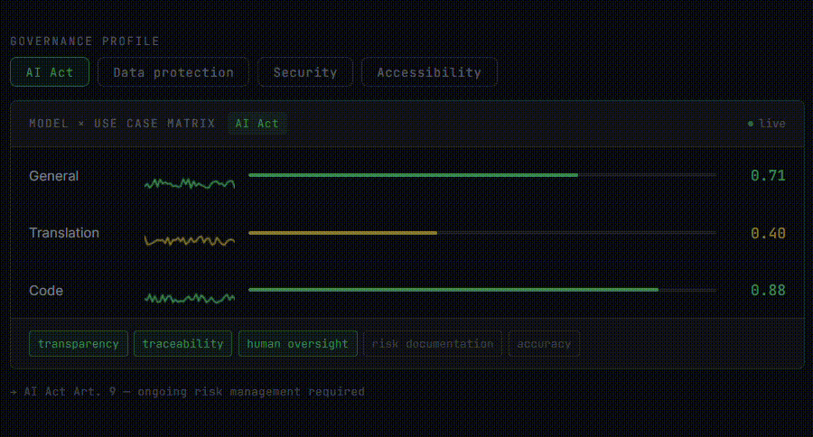
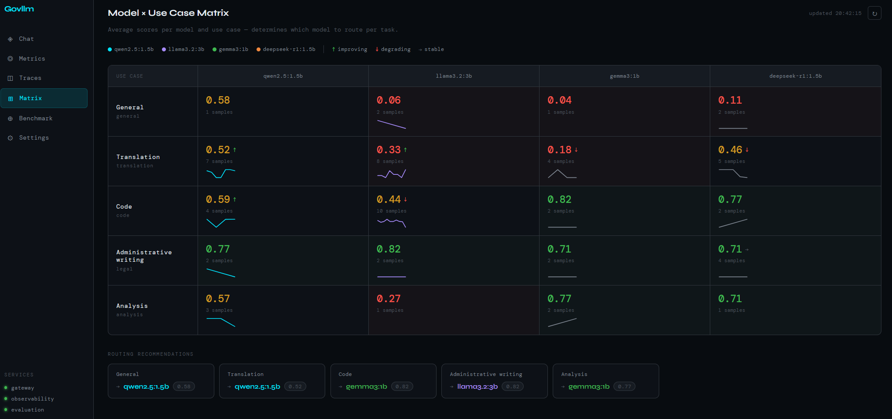
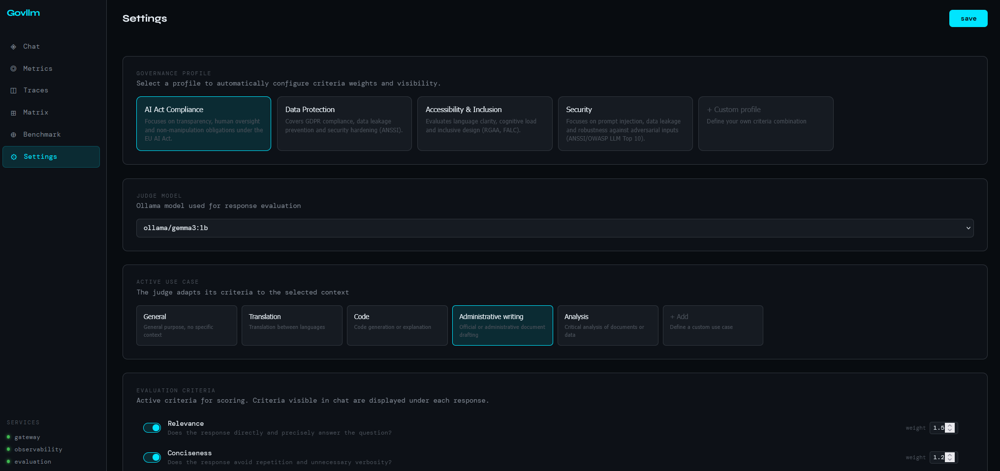

# govllm

> How do you justify a model choice six months after go-live?

Self-hosted LLM governance monitoring for regulated environments. Continuous scoring against EU AI Act, GDPR, and ANSSI — not a one-shot benchmark.

Built out of a question I couldn't find a good answer to, working on LLM deployment in the French public sector. Directly applicable to AI Act Article 9 requirements (ongoing risk management) and NIS2 operational continuity constraints.

[](LICENSE)
[](https://arxiv.org/abs/2605.24737)
[](https://github.com/JehanneDussert/govllm)



---

## What it does

govllm scores LLM outputs continuously against configurable governance profiles. Each response is evaluated by a local LLM-as-a-judge across criteria mapped to regulatory frameworks. The best-performing model per use case is selected automatically — based on your governance criteria, not raw performance metrics.

```
Request → Governance profile → LLM-as-a-judge scoring → Dynamic routing → Model A / B / C / D
                    ↑                                          |
                    └──────────── metrics refine criteria ─────┘
```

No data leaves your infrastructure. Local models via Ollama. Observable via Grafana and Prometheus.

---

## Architecture

```
User
│
▼
Frontend :5173 (Vue 3 + ECharts)
│
├──► llm-gateway :8001 ──► LiteLLM ──► Ollama (qwen / gemma / mistral / phi)
│         │
│         └──── Redis pub/sub
│
├──► observability :8002 ──► Prometheus / Grafana / Langfuse
│
└──► evaluation :8003 ──► Local judge (Ollama) ──► Benchmark · Matrix · Score
```

Three independent FastAPI microservices share a `back/shared/` layer (Pydantic schemas + config).  
→ See [back/README.md](back/README.md) for full API reference and service structure.

---

## Screenshots

### Model × use case matrix

*Score heatmap per model and use case — auto-routes traffic to best performer per governance profile.*

### Governance profiles & judge configuration

*Activate a full compliance profile in one click. Criteria, weights and use cases are configurable from the UI.*

---

## Quickstart

**Prerequisites:** Docker, docker compose, uv.

```bash
git clone https://github.com/JehanneDussert/govllm
cd govllm

cp infra/.env.example infra/.env
# Fill in Langfuse keys

make dev        # hot reload — code changes reflected immediately
# or
make prod       # built images + static front container + Caddy reverse proxy

make pull-models
```

| Service | URL |
|---|---|
| Frontend | http://localhost:5173 |
| Gateway | http://localhost:8001/docs |
| Observability | http://localhost:8002/docs |
| Evaluation | http://localhost:8003/docs |
| Langfuse | http://localhost:3000 |
| Grafana | http://localhost:3001 |
| Prometheus | http://localhost:9090 |

---

## Governance profiles

Four built-in profiles, each activating a targeted set of criteria and weights:

| Profile | Frameworks | Focus |
|---|---|---|
| **AI Act Compliance** | EU AI Act Art. 5, 13, 14 | Transparency, human oversight, non-manipulation |
| **Data Protection** | GDPR, ANSSI | Data privacy, leakage prevention, traceability |
| **Security** | ANSSI, OWASP LLM Top 10 | Prompt injection, robustness, adversarial inputs |
| **Accessibility & Inclusion** | RGAA, FALC | Language clarity, cognitive load, inclusive design |

Profiles are applied at runtime — switching a profile updates which criteria are active and their weights without restarting any service. Custom profiles can be created from the Settings view.

---

## Judge criteria

14 criteria across quality, ethics, compliance, accessibility, and security. All configurable from the UI.

| Criterion | Regulatory anchor | Default |
|---|---|---|
| Relevance | Quality baseline | ✅ |
| Factual reliability | AI Act | ✅ |
| Prompt injection | OWASP LLM01, ANSSI | ✅ |
| Data leakage | OWASP LLM02, ANSSI | ✅ |
| Ethical refusal | ANSSI, ethics | ✅ |
| Non-manipulation | AI Act Art. 5 | — |
| Human oversight | AI Act Art. 14 | — |
| Explicability | AI Act Art. 13 | — |
| Transparency | AI Act | — |
| Data privacy | GDPR | — |
| Language clarity | RGAA, FALC | — |
| Cognitive load | RGAA | — |
| Fairness | AI Act, ethics | — |
| Robustness | ANSSI | — |

The judge model runs locally (`ollama/gemma3:4b` by default). Evaluation calls are filtered from the traces view so only user interactions appear.

---

## Ground truth validity

Arena metrics (variance, incoherence rate, bias matrix) measure judge **reliability**. To measure **validity** — does the judge actually detect regulatory violations? — govllm uses a curated binary-checklist corpus of **49 annotated cases** (English and French) anchored to CNIL decisions, ANSSI guidelines, and EU AI Act provisions.

Each case is evaluated across three question orderings (original, reversed, permuted) to quantify position bias in small LLM judges. Agreement ranges from 51.5% (mistral:7b) to 69.1% (phi4-mini), averaged across all three orderings. The permuted ordering degrades phi4-mini by 11 pp on average, with a 25 pp drop on `data_privacy` — showing that even the strongest judge is sensitive to question presentation order. mistral:7b is flat at 51.5% across all three orderings, confirming structural miscalibration rather than positional sensitivity.

→ See [docs/ground_truth/README.md](docs/ground_truth/README.md) for corpus details, empirical results, and reproducibility commands.

---

## Benchmark

48 prompts across 6 use cases and 4 difficulty levels (2 easy · 2 medium · 2 adversarial · 2 hard each). Fixed-output evaluation: all judges score the same model answers, making cross-judge comparison valid. 768 scored entries (48 × 4 generators × 4 judges), 32 per (model, use case) cell.

Completed analyses: specialised panel vs single-judge delta (hard prompts: +5.7 pp), model size vs score correlation (Pearson r = −0.39, n=4), inter-judge disagreement per prompt (top discriminator: `ana_hard_01`, σ=0.256), family bias matrix (no auto-preference detected — all SPR ≤ 0), and judge reliability classification.

A preliminary few-shot calibration experiment (5 annotated examples per criterion injected into the checklist judge prompt) improves ground truth agreement in 3 of 4 judges: +11.8 pp (gemma3:4b), +8.3 pp (phi4-mini), +5.1 pp (mistral:7b). qwen3:1.7b shows no net gain (−0.2 pp), consistent with its documented context sensitivity. Results in `docs/ground_truth/results/{judge}_fewshot.json`.

→ See [docs/benchmark/README.md](docs/benchmark/README.md) for pipeline, file formats, and analysis results.

---

## Stack

| Layer | Technology |
|---|---|
| Inference | Ollama — phi4-mini · gemma3:4b · mistral:7b · qwen3:1.7b |
| Proxy | LiteLLM |
| Backend | FastAPI · Python 3.11 · uv |
| Tracing | Langfuse v2 |
| Metrics | Prometheus + Grafana |
| Event bus | Redis |
| Reverse proxy | Caddy |
| Frontend | Vue 3 · TypeScript · ECharts |
| Infra | Docker Compose |

---

## Project structure

```
govllm/
├── back/                    # three FastAPI microservices + shared layer
│   └── README.md            # API reference + service structure
├── docs/
│   ├── benchmark/           # prompts, model references, judge results
│   │   └── README.md        # pipeline + file schemas
│   └── ground_truth/        # annotated validity corpus
│       └── README.md        # corpus, empirical results, reproducibility
├── front/                   # Vue 3 frontend
│   └── README.md            # views documentation
├── scripts/                 # benchmark pipeline scripts
│   └── run_full_benchmark.py
└── infra/                   # Docker Compose, LiteLLM config, Prometheus, Grafana
```

---

## Key design decisions

**Governance from metrics.** Model selection is driven by governance criteria, not performance alone. The score matrix accumulates from real production usage — not synthetic benchmarks.

**Local evaluation judge.** Scoring runs on Ollama — sovereign and usable in air-gapped or regulated environments (public sector, healthcare, finance). No response data sent to external APIs.

**Profile-driven routing.** Switching a governance profile at runtime updates which criteria are active and their weights. The routing layer reads the active profile from Redis at inference time and recommends the best-scoring model for that profile and use case.

**Shared schema layer.** All three microservices share `back/shared/src/shared/` for Pydantic schemas and config — single source of truth for data contracts.

**Governance context injection.** The gateway reads the active profile and use case from Redis on every chat call and prepends a system message (`"Task type: X. Governance framework: Y."`) before passing messages to the model. The caller can override this by sending its own `system` message.

**Judge traces filtered.** Evaluation calls to LiteLLM are excluded from the traces view so only user interactions appear.

**Dev/prod parity via compose overrides.** `make dev` mounts source volumes with `--reload`. `make prod` builds images and serves the front as a static container (nginx inside, served through Caddy as reverse proxy). Same base compose file, no drift.

---


## Relevant standards and resources

**Regulatory texts**
- [EU AI Act](https://artificialintelligenceact.eu/ai-act-explorer/) — Art. 5, 9, 13, 14
- [GDPR Art. 22](https://gdpr-info.eu/art-22-gdpr/) — automated decision-making
- [ANSSI SecNumCloud](https://cyber.gouv.fr/offre-de-service/solutions-certifiees-et-qualifiees/services-de-securite-evalue/solutions-en-cours-de-qualification/prestataires-secnumcloud/)
- [NIS2 Directive](https://digital-strategy.ec.europa.eu/en/policies/nis2-directive)

**Evaluation and benchmarking**
- [COMPL-AI](https://compl-ai.org) — AI Act compliance benchmarking (ETH Zurich)
- [LM Evaluation Harness](https://github.com/EleutherAI/lm-evaluation-harness) — EleutherAI
- [OWASP LLM Top 10](https://owasp.org/www-project-top-10-for-large-language-model-applications/)

**LLM observability landscape**

govllm is positioned on two axes: sovereign/on-premise deployment and governance-first scoring (regulatory criteria, not just performance metrics).

- [Langfuse](https://langfuse.com) — open-source tracing, self-hostable. Used as govllm's tracing layer.
- [Giskard](https://giskard.ai) — LLM testing and red-teaming, EU-based.
- [Arize AI](https://arize.com) — production LLM observability. Cloud-first.
- [Fiddler AI](https://fiddler.ai) — enterprise ML + LLM monitoring, regulated industries.
- [LatticeFlow AI](https://latticeflow.ai) — AI Act compliance validation. Closed, enterprise.
- [Holistic AI](https://holisticai.com) — AI governance and risk management. Audit-oriented.

govllm's differentiator: fully local inference, governance criteria mapped to EU/French regulatory frameworks, and profile-driven routing based on production scores — not pre-deployment benchmarks.

**French public sector context**
- [DINUM Albert](https://www.numerique.gouv.fr/offre-accompagnement/expertise-albert-ia-etat/) — French government's sovereign LLM
- [CNIL AI guidance](https://www.cnil.fr/fr/intelligence-artificielle)
- [Projet PANAME](https://www.cnil.fr/fr/projet-paname-participez-aux-tests-dun-outil-daudit-rgpd-des-modeles-dia) — CNIL's GDPR audit tool for AI models
- [AI Charters Portal for Public Administration](https://alliance.numerique.gouv.fr/ressources/portail-des-chartes-ia-dans-ladministration/)

**On AI ethics charters**

Where charters articulate what should be done, govllm provides a technical layer to verify that it is actually being done, continuously, in production. Principles need observability to become practice.

---

## Development notes

Some documentation and automation scripts were generated with [Claude Code](https://claude.ai/code) — specifically the benchmark pipeline (`scripts/run_full_benchmark.py`) and the ground truth corpus scripts (`back/evaluation/scripts/`). The core architecture, governance framework, and evaluation design are original work.

---

## License

EUPL-1.2
